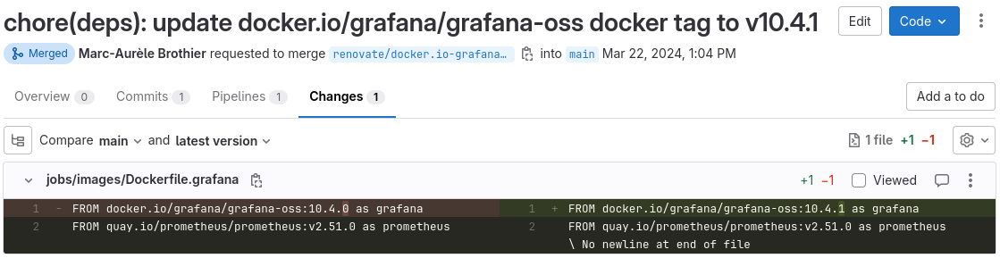

I run a Nomad cluster at home for my internal services which grows from time to time. It reached a level now that staying up to date with the different services' updates is too much work, and too manual for me. I neither run my service with `latest` as you do not have any control on the version. I had to find a way to automate MRs/PRs to propose updates whenever a new tag is pushed. Having discovered the power of [Renovate](https://docs.renovatebot.com/) *(highly recommended over Dependabot)*, and having it already setup to push updates in my development projects, I wanted to leverage it for my infrastructure configuration.

## Nomad job definitions

With Nomad's job definition, the `image` attribute contains the link to the registry and the tag to use. This syntax is not recognized by Renovate bot as it cannot parse the HCL file.

Extract of a Grafana + Prometheus service job definition:

```hcl
job "grafana" {
  type        = "service"

  group "grafana" {

    task "grafana" {
      driver = "docker"

      config {
        image           = "docker.io/grafana/grafana-oss:10.4.1"
        ports           = ["http"]
        readonly_rootfs = true
        cap_drop        = ["ALL"]
        ...
      }
```

Renovate will simply ignore the content of the file and cannot update the image url despite being a standard container image syntax. One way of solving this issue would have been to write the [dependency manager](https://docs.renovatebot.com/modules/manager/) for Nomad HCL files for the project. I have to admit I did not want to learn enough TypeScript in order to propose this change and took another easier approach.

## The trick

Instead of directly including the image link in the job file, we can leverage the [HCL functions](https://developer.hashicorp.com/nomad/docs/job-specification/hcl2/functions) to retrieve the container image definition from another file that Renovate (or any other dependency update manager like Dependabot) can parse and update. So the trick is to use a companion `Dockerfile` where there is only the `FROM` line pointing to the image(s) we want to use in the job, and use the HCL functions to read its content. For the Grafana service, the content of the `Dockerfile.grafana` is as follow:

```Dockerfile
FROM docker.io/grafana/grafana-oss:10.4.1 as grafana
FROM quay.io/prometheus/prometheus:v2.51.0 as prometheus
```

It contains a `as` to put the image definition into a *map*, rather than using a simple list with indexes (not very readable).

The files are organized with the job definitions inside `jobs/` and the companion `Dockerfile` in the sub-directory `jobs/images/`:

```console
...
├── jobs
│   ├── grafana.hcl
│   ├── images
│   │   ├── Dockerfile.grafana
...
```

Strangely the [Nomad HCL2](https://developer.hashicorp.com/nomad/docs/job-specification/hcl2) language is only a subset of the [Terraform HCL](https://developer.hashicorp.com/terraform/language/functions) one which contains more functions. Nevertheless there is enough in the Nomad HCL to do the job. The Nomad HCL code to read the image from the file:

```hcl
locals {
  container_file = "images/Dockerfile.grafana"
  container_images = {
    for word in [
      for line in compact(split(
        "\n",
        fileexists("./jobs/${local.container_file}") ? file("./jobs/${local.container_file}") : file("./${local.container_file}")
      )) : split(" ", trimspace(line))
    ] : word[3] => word[1]
  } # FROM image as name -> {"name" = "image"}
}
```

The code uses [`fileexists()`](https://developer.hashicorp.com/nomad/docs/job-specification/hcl2/functions/file/fileexists) because the [`file()`](https://developer.hashicorp.com/nomad/docs/job-specification/hcl2/functions/file/file) function will be executed within the same path as where the `nomad` will be executed. As I can be in the root or inside the `jobs` directory when I ran commands, it requires to handle both case. It's something you can simplify. The `compact(split())` is to remove empty lines from the `Dockerfile` in case there are any at the end, or spaces between images. For information, the syntax does not support any comments added to the file `Dockerfile`.

It allows to reference the image later in the job definition with the local variable:

```hcl
    task "grafana" {
      driver = "docker"

      config {
        image           = local.container_images["grafana"]
        ports           = ["http"]
        readonly_rootfs = true
```

Renovate is now able to open merge requests to keep up to date the `Dockerfile` used for each service:


