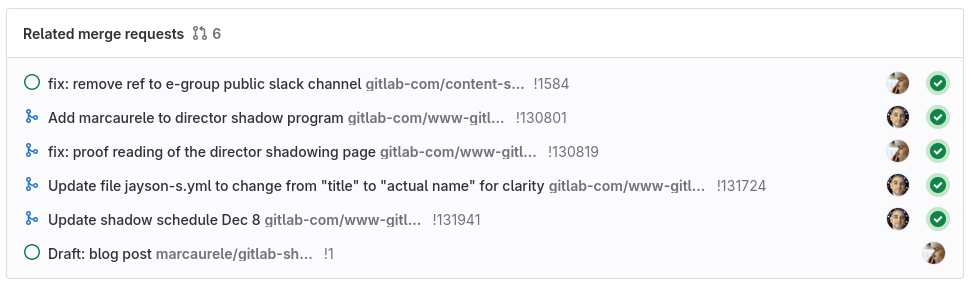

## Summary

Last December I spent [one week shadowing Wayne Haber](https://handbook.gitlab.com/handbook/engineering/development/director-shadow-program/), Engineering Director of Secure, Govern and Growth at [GitLab](https://gitlab.com/). While I'm not a GitLab employee, this opportunity was possible thanks to the [openness of GitLab](https://about.gitlab.com/blog/2016/07/12/our-handbook-is-open-source-heres-why/) in describing [how they work](https://handbook.gitlab.com/) and their [amount of information available to the public](https://handbook.gitlab.com/handbook/values/#transparency).

## What motivated me?

During one of my previous experiences, I asked other managers to be able to shadow how they were running their planning team meetings. I wanted to get a sense on how engineers were discussing their priorities and on-going work together, seeing as well how company projects were handled by each of them. I found the experience very rewarding as you are usually working in a single team and cannot experience different environments easily at the same company.
For this reason, when I came across a post from Wayne about [his shadow program](https://handbook.gitlab.com/handbook/engineering/development/director-shadow-program/), I immediately kept the link in my *One Day[^1]* list to pick it up when I will have more time. I was interested to see what could be different from managing managers rather than ICs, how TeamOps was used on a day to day basis at GitLab (openness and async communication) and how the groups Secure, Govern and Growth were handled by Wayne.
So back in October when I had a medical leave after an injury the item came back to my sight and I sent a request to Wayne who quickly accepted it. [I was in!](https://mastodon.social/@marcaurele/111308876640199866)

I have to admit, I really love GitLab and are following them since many years because of their openness.

## Preparation

What I like from people I met working at GitLab is that they are leveraging their tool in good way to keep with the async communication. For the shadow program with Wayne, this means having [a full issue with all the items](https://gitlab.com/wayne/wayne/-/issues/2) to be done: prior, during and after the shadowing week. It was also used as a reference ticket to link all the contributions I would do which were driven by the shadowing week.

Things cannot be clearer! I had already done the [TeamOps free training](https://levelup.gitlab.com/courses/teamops) from GitLab back in November 2022 when it came out eager to understand better all their async best practices.
To get a better sense of the actual subjects and people, I watched 2-3 of the latest *"Sec growth senior leaders development staff meeting"* you can find on the [GitLab Youtube channel](https://www.youtube.com/@GitLabUnfiltered/search?query=sec%20growth%20development), which I recommend for people on-boarded in the program.
We had a first video call with Wayne to sync on the shadow program, what was to be prepared before the week started and what were my expectations of the shadowing week.

On the Friday prior to the start, Wayne shared with me a file with his notes for the coming week containing his priorities and the meetings overview I would be participating in. As you could imagine, I was eager to have more meetings but not all can be public with an external person. GitLab employees, who participate in the program, do have a better experience as they can participate in more meetings.

## The week

I'm living in Switzerland, meaning 5 hours ahead of Wayne's time who is based in the US, in Atlanta, GA. Despite being able to do most of the meetings along side my job as the overlap is short, I took all afternoons off in order to be able to dive into topics, navigate the handbook and be fully available for any meeting.
On Monday afternoon, my time, was the first meeting with Wayne to get a sense of the topics for the week, explaining as well the content and structure of the shared notes file.

I had the opportunity to meet 8 GitLab employees, including Wayne, and 2 contractors during that week over Zoom calls, from direct reports, skip levels, to Wayne's manager. As a manager myself, all the meetings were about topics I would expect. Even if there is a lot of open topics, meetings are mainly to address private ones so they would last up to about 30 minutes. It was interesting to hear about some of their current technical challenges and how they approach solutions. I could also experience how Wayne was introducing the GitLab way of working to new contractors starting on a project to ensure a smooth communication with the team, which is a major ingredient in remote only company.

What I liked most of course, is that thanks to GitLab openness, many topics can be followed publicly with their issues. You need Wayne's input to find the needle in the hay stack, there are so many! I wonder how their CI handle it all.

A shared problematic, common to many or all software companies, was the speed of getting the merge requests in which popped up recently. I caught this in a previous senior leaders staff meeting, but sadly my week was not one with the team to be able to follow up on that.

Through the dedicated shadow program's Slack channel, Wayne would post links and comments on topics and issues he was working on, or was going to read, seeking to have any sort of feedback on them. I spent a good amount of time reading the merge requests comments, following the links to get more context. My humble contributions were mainly proof reading to catch typos. As a reader of the Handbook, it feels better to have a clear content.

At one occasion I could feel some stress from Wayne when he knew less than 24 hours prior to a meeting that he had to cover for his manager at the CTO OKR monthly review to report his groups as well as all the other ones under his manager. It was a chase to find the right people on top of the time zone differences for the items missing updates since the last report. There you can see the scale of GitLab.

One recommendation I would do to future shadows, is to get in the 1-1 meetings you are invited ahead of time. It provides opportunities to do a coffee chat discussion with the other person, as well as checking each person GitLab repo to find some information about them (location, README). It's a good source to find common topics to talk about. It made me catch that one of the meeting was with someone in Switzerland which I would not have guessed otherwise.

## What it is not about

- not about technical topics, but if some of the current challenges ring a bell to you and you have an open source committer's mind, you will get the direct pointer to help them out.
- not about getting hired as Wayne pointed it out in [his shadow program page](https://handbook.gitlab.com/handbook/engineering/development/director-shadow-program/#what-this-program-is-not).
- it's not intense and if you cannot attend most of the meetings for whatever reason, it will not affect Wayne's week in a bad way.

## Observations

1. Wayne looks well organized with his habits and is taking extra time and effort to duplicate things for the shadow with disclosable information.
2. I could observed his servant leadership line with the listening, empathy, building community, persuasion principles to name a few.
3. GitLab, as many other IT companies, had to realign its workforce, and despite the difficult past moments, everyone was engaged and happy to contribute.

## What's next

This shadow week gave me more confidence in how am I doing my leadership work with my team. It made me think through my weekly habits to seek more effectiveness and in ways to push more for asynchronous habits within my team. Last but not least, I will seek to participate in a [mentor+mentee program](https://www.mentoring-club.com/the-mentors/marc-aurele-brothier) to have regular exchange with peers from other companies.

Thank you [Wayne](https://www.linkedin.com/in/waynehaber/) for the opportunity and GitLab / [Sid Sijbrandij](https://www.linkedin.com/in/sijbrandij/) for the openness of GitLab which allow to access many information, making [this Shadow program](https://handbook.gitlab.com/handbook/engineering/development/director-shadow-program/) possible.

---

*Blog post source and merge request comments available at <https://gitlab.com/marcaurele/gitlab-shadow-program/>*

[^1]: I follow the Inbox-Zero method and keep those items with a dedicated flag in it, avoiding having too many tools.
